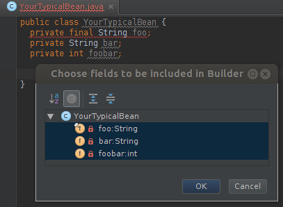

innerbuilder [](https://travis-ci.org/analytically/innerbuilder)
============

[IntelliJ IDEA](https://www.jetbrains.com/idea/) [plugin](https://plugins.jetbrains.com/plugin/7354-innerbuilder/) that 
adds a 'Builder' action to the Generate menu (Alt+Insert) which generates an inner builder class as described in 
the [Effective Java book](https://www.oreilly.com/library/view/effective-java-3rd/9780134686097/). Works with 
[IntelliJ IDEA](https://www.jetbrains.com/idea/) 2019 and later.



```java
public class JavaBean {
    private final String foo;
    private String bar;
    private int qux;
    private Double x,y;

    private JavaBean(Builder builder) {
        foo = builder.foo;
        bar = builder.bar;
        qux = builder.qux;
        x = builder.x;
        y = builder.y;
    }

    public static Builder newJavaBean() {
        return new Builder();
    }

    public static final class Builder {
        private String foo;
        private String bar;
        private int qux;
        private Double x;
        private Double y;

        private Builder() {
        }

        public Builder foo(String val) {
            foo = val;
            return this;
        }

        public Builder bar(String val) {
            bar = val;
            return this;
        }

        public Builder qux(int val) {
            qux = val;
            return this;
        }

        public Builder x(Double val) {
            x = val;
            return this;
        }

        public Builder y(Double val) {
            y = val;
            return this;
        }

        public JavaBean build() {
            return new JavaBean(this);
        }
    }
}
```

### Installation

In IntelliJ IDEA 2019 or later, open `Preferences...` > `Plugins`, search for `innerbuilder`. It should show up in 
the plugin list, click `INSTALL`.

#### Manual installation

Download the plugin jar `innerbuilder.jar` and select `Install Plugin From Disk` in IntelliJ's plugin preferences.

### Usage

Use `Shift+Alt+B` or `Alt+Insert` and select `Builder...`. Choose the fields to be included and press `OK`. When generating a
builder when a builder already exists, the plugin will try to update it. It will add missing fields and builder methods, but
never remove any fields or methods.

### Rate

If you enjoy this plugin, please rate it on its [plugins.jetbrains.com page](https://plugins.jetbrains.com/plugin/7354-innerbuilder/).

### Building

- Run `./prepare-build.sh` to download IntelliJ IDEA Community Edition
- Run `mvn package`

### License

Licensed under the [Apache License, Version 2.0](http://www.apache.org/licenses/LICENSE-2.0).